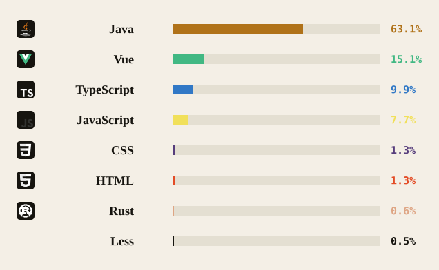

<!-- ═══════════════════════════════════════════════════════════════
     LZJYZQ2  ·  ISSUE 01 / 第一期
     ── 你需要维护的占位符（仅此 3 处，其余全自动）────────────
     ① 编者语：下方 > 区块内的中英文个人简介 + 城市/时区
     ② 精选作品：项目名、链接、一行简介（表格内）
     ③ 找到我：邮箱与社交账号链接
     技术栈语言卡 / GitHub 统计 / streak → 由 API 自动生成，无需维护
     ═══════════════════════════════════════════════════════════════ -->

  

  <b>VOL. 01 / 第一期</b> &nbsp;·&nbsp; AUGUST 2026 / 二〇二六年八月 &nbsp;·&nbsp; A CULTURE &amp; CODE REVIEW / 文化评论

 

<!-- ── ① 编者语 ────────────────────────────────────────────── -->
> ### ◇ &nbsp; A Note From The Editor &nbsp;·&nbsp; 编者语
>
> 我是街上的游魂，而你是闻到我的人。
>
> *I wander these streets as a restless soul — and you're the one who caught my scent.*
>
> &nbsp;&nbsp;&nbsp;&nbsp; **— lzjyzq2**
> &nbsp;&nbsp;&nbsp;&nbsp; 成都 · China Standard Time (UTC+8)

 

<!-- ── ② 精选作品 ──────────────────────────────────────────── -->
## ◧ &nbsp; Selected Works &nbsp;·&nbsp; 精选作品

| № | 作品 / Works |
| --- | --- |
| 01 | **[ zlua ](https://github.com/lzjyzq2/zlua)** &nbsp;—&nbsp; 一个 Java 实现的 Lua 虚拟机 / A Lua VM implemented in Java |
| 02 | **[ varlet ](https://github.com/varletjs/varlet)** &nbsp;—&nbsp; 基于 Material Design 2 & 3 的 Vue3 组件库，支持移动端与桌面端 / A Vue3 component library based on Material Design 2 & 3 |
| 03 | **[ UbiGamesBackupTool ](https://github.com/lzjyzq2/UbiGamesBackupTool)** &nbsp;—&nbsp; 育碧游戏存档备份工具 / Ubisoft game save backup tool |
| 04 | **[ Aircraft ](https://github.com/lzjyzq2/Aircraft)** &nbsp;—&nbsp; 基于 Java Swing 实现的飞机大战游戏 / A shoot-'em-up game built with Java Swing |
| 05 | **[ Lson ](https://github.com/lzjyzq2/Lson)** &nbsp;—&nbsp; 一个 Java 实现的 JSON 解析器 / A JSON parser written in Java |
| 06 | **[ FileServer ](https://github.com/lzjyzq2/FileServer)** &nbsp;—&nbsp; 基于 NanoHttpd 二次开发的文件上传 WebServer / A file-upload server built on NanoHttpd |

 

<!-- ── 技术栈（自动从公共仓库生成）──────────────────────────── -->
## ◧ &nbsp; The Stack &nbsp;·&nbsp; 技术栈

  <i>The shape of my work, measured in the languages I commit to most. / 作品的形状，以我投入最多的语言丈量。</i>

  

 

<!-- ── 数据之上（自动）──────────────────────────────────────── -->
## ◧ &nbsp; By The Numbers &nbsp;·&nbsp; 数据之上

  <picture>
    <source media="(prefers-color-scheme: dark)" srcset="https://github-profile-summary-cards.vercel.app/api/cards/profile-details?username=lzjyzq2&theme=default&bg_color=12110D&title_color=F2EEE4&text_color=9B9588&icon_color=FF5A52" />
    
  </picture>

 

<!-- ── 贪吃蛇活动图（自动）──────────────────────────────────── -->
## ◧ &nbsp; Activity &nbsp;·&nbsp; 活动

  <picture>
    <source media="(prefers-color-scheme: dark)" srcset="https://raw.githubusercontent.com/lzjyzq2/lzjyzq2/output/github-contribution-grid-snake-dark.svg" />
    
  </picture>

 

<!-- ── ③ 找到我 ────────────────────────────────────────────── -->
## ◧ &nbsp; Find Me &nbsp;·&nbsp; 找到我

  <a href="mailto:lzjyzq2@qq.com">✉️ <b>Email / 邮箱</b></a> &nbsp;·&nbsp;
  <a href="https://space.bilibili.com/5725142">▶ <b>Bilibili</b></a> &nbsp;·&nbsp;
  <a href="https://lzjyzq2.settile.cn">◉ <b>Website / 网站</b></a> &nbsp;·&nbsp;
  <a href="https://www.xiaohongshu.com/user/profile/66bf3e8d000000001d0339d8">◎ <b>XHS / 小红书</b></a> &nbsp;·&nbsp;
  <a href="https://github.com/lzjyzq2">⌥ <b>GitHub</b></a>

 

<!-- ── 版权页 ───────────────────────────────────────────────── -->

  © 2026 <b>lzjyzq2</b> &nbsp;·&nbsp; Set in <i>Georgia</i> &amp; <i>Helvetica</i> / 字体：Georgia、Helvetica &nbsp;·&nbsp; PRINTED IN PIXELS / 像素印刷

